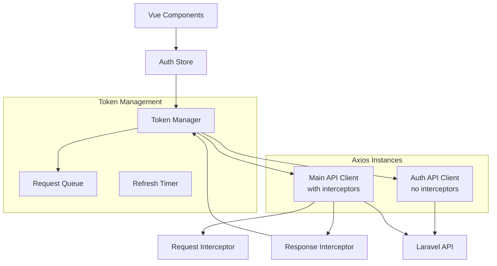

# Design Document

## Overview

This design addresses the critical authentication loop issue in the Vue.js + Laravel application by implementing a robust token refresh mechanism that prevents axios interceptor conflicts. The solution uses a dual-axios-instance approach combined with request queuing and proper state management to ensure reliable authentication flows without infinite loops.

The core problem stems from the refresh token request using the same axios instance with interceptors, causing recursive calls when the refresh itself returns a 401 error. Our solution implements a separate, interceptor-free axios instance for authentication operations while maintaining a request queue for failed requests during token refresh.

## Architecture

### Component Overview



### Key Architectural Decisions

1. **Dual Axios Instance Pattern**: Separate axios instances for regular API calls and authentication operations
2. **Request Queue Management**: Queue failed requests during token refresh and retry them with new tokens
3. **Centralized Token Management**: Single source of truth for token state and refresh logic
4. **Proactive Token Refresh**: Timer-based refresh before expiration to minimize user-facing token issues

## Components and Interfaces

### Token Manager

The Token Manager is the central component responsible for all token-related operations:

```typescript
interface TokenManager {
  // Token refresh operations
  refreshToken(): Promise<AuthResponse>
  isRefreshing(): boolean
  
  // Request queue management
  queueRequest(config: AxiosRequestConfig): Promise<any>
  processQueue(token?: string, error?: Error): void
  
  // Token validation and timing
  isTokenExpired(token: string): boolean
  shouldRefreshToken(token: string): boolean
  startRefreshTimer(): void
  stopRefreshTimer(): void
}
```

### API Client Factory

Creates and configures axios instances with appropriate interceptors:

```typescript
interface APIClientFactory {
  createMainClient(): AxiosInstance
  createAuthClient(): AxiosInstance
  setupInterceptors(client: AxiosInstance): void
}
```

### Auth Store Interface

Pinia store managing authentication state:

```typescript
interface AuthStore {
  // State
  user: User | null
  isAuthenticated: boolean
  isLoading: boolean
  
  // Actions
  login(credentials: LoginCredentials): Promise<void>
  logout(): Promise<void>
  refreshToken(): Promise<void>
  clearAuthData(): void
  
  // Getters
  getAccessToken(): string | null
  getRefreshToken(): string | null
}
```

### Request Queue Interface

Manages failed requests during token refresh:

```typescript
interface RequestQueue {
  add(config: AxiosRequestConfig, resolve: Function, reject: Function): void
  process(token?: string, error?: Error): void
  clear(): void
  size(): number
}
```

## Data Models

### Authentication Response

```typescript
interface AuthResponse {
  user: User
  access_token: string
  refresh_token: string
  expires_in: number
  token_type: string
}
```

### User Model

```typescript
interface User {
  id: number
  name: string
  email: string
  email_verified_at: string | null
  created_at: string
  updated_at: string
}
```

### Token Payload

```typescript
interface TokenPayload {
  sub: string
  iat: number
  exp: number
  nbf: number
  jti: string
}
```

### Queued Request

```typescript
interface QueuedRequest {
  config: AxiosRequestConfig
  resolve: (value: any) => void
  reject: (reason: any) => void
  timestamp: number
}
```
## Correctness Properties

*A property is a characteristic or behavior that should hold true across all valid executions of a system-essentially, a formal statement about what the system should do. Properties serve as the bridge between human-readable specifications and machine-verifiable correctness guarantees.*

### Property 1: Refresh Request Isolation
*For any* token refresh operation, the refresh request should use a separate axios instance without response interceptors, preventing recursive interceptor calls.
**Validates: Requirements 1.1, 1.2**

### Property 2: Refresh Concurrency Control
*For any* scenario where multiple requests trigger token refresh simultaneously, only one refresh operation should execute while others wait, and all requests should be queued for retry.
**Validates: Requirements 1.3, 1.4**

### Property 3: Refresh Failure Cleanup
*For any* failed token refresh operation, the system should clear all authentication state, remove stored tokens, and redirect to login.
**Validates: Requirements 1.5, 2.3**

### Property 4: 401 Response Flow
*For any* API request that receives a 401 unauthorized response, the system should attempt token refresh and retry the original request with the new token if refresh succeeds.
**Validates: Requirements 2.1, 2.2**

### Property 5: Network Error Resilience
*For any* network error during token refresh, the system should handle the error gracefully without creating infinite loops or recursive calls.
**Validates: Requirements 2.5**

### Property 6: Secure Token Storage and Synchronization
*For any* successful authentication or token refresh, tokens should be stored securely and all API clients should immediately use the updated tokens.
**Validates: Requirements 3.1, 6.2**

### Property 7: Logout Cleanup and Redirect
*For any* logout operation, the system should clear all authentication data, invalidate server tokens, and redirect to login after cleanup completion.
**Validates: Requirements 3.2, 3.5**

### Property 8: Automatic Session Management
*For any* user session where tokens are near expiration or expired, the system should attempt automatic token refresh before requiring re-authentication.
**Validates: Requirements 3.4, 4.1**

### Property 9: Token State Synchronization
*For any* token refresh operation, the auth store should immediately update with new token values while maintaining all other user application state.
**Validates: Requirements 4.2, 4.3**

### Property 10: Expired Refresh Token Handling
*For any* refresh token that is expired or invalid, the system should require user re-authentication and handle malformed token data gracefully.
**Validates: Requirements 4.4, 4.5**

### Property 11: Request Queue Management
*For any* set of failed requests due to expired tokens, all requests should be queued with original configurations preserved, then either retried with new tokens on successful refresh or rejected on refresh failure.
**Validates: Requirements 5.1, 5.2, 5.3, 5.4**

### Property 12: Queue Size Limits
*For any* request queue, the system should prevent memory issues by limiting queue size to reasonable bounds and handling queue overflow gracefully.
**Validates: Requirements 5.5**

### Property 13: Authentication State Reactivity
*For any* authentication state change, all dependent components should be notified immediately and user-related data should be cleared on authentication failure.
**Validates: Requirements 6.1, 6.3**

### Property 14: Cross-Session State Persistence
*For any* page refresh or browser tab interaction, authentication state should be restored from secure storage and synchronized across tabs.
**Validates: Requirements 6.4, 6.5**

## Error Handling

### Authentication Error Categories

1. **Token Expiration Errors**: Handle expired JWT tokens through automatic refresh
2. **Refresh Token Errors**: Handle invalid or expired refresh tokens by requiring re-authentication
3. **Network Errors**: Handle connectivity issues during authentication operations
4. **Server Errors**: Handle 5xx responses from authentication endpoints
5. **Malformed Token Errors**: Handle corrupted or invalid token data

### Error Recovery Strategies

- **Exponential Backoff**: Implement retry logic with exponential backoff for network errors
- **Circuit Breaker**: Prevent cascading failures by temporarily disabling refresh attempts after repeated failures
- **Graceful Degradation**: Maintain application functionality where possible during authentication issues
- **User Feedback**: Provide clear, actionable error messages for authentication failures

### Error Boundaries

```typescript
interface ErrorBoundary {
  // Prevent errors from propagating beyond authentication system
  containAuthErrors(error: AuthError): void
  
  // Provide fallback behavior for critical failures
  handleCriticalFailure(error: CriticalAuthError): void
  
  // Log errors for debugging while protecting sensitive data
  logAuthError(error: AuthError, context: ErrorContext): void
}
```

## Testing Strategy

### Dual Testing Approach

The authentication system requires both unit testing and property-based testing for comprehensive coverage:

**Unit Tests** focus on:
- Specific authentication scenarios (login success/failure, logout flow)
- Edge cases (malformed tokens, network timeouts, server errors)
- Integration points between components (store updates, API client configuration)
- Error conditions and recovery mechanisms

**Property Tests** focus on:
- Universal properties that hold across all authentication operations
- Comprehensive input coverage through randomization (various token states, timing scenarios)
- Invariants that must be maintained (no infinite loops, consistent state)
- Concurrent operation behavior (multiple simultaneous requests)

### Property-Based Testing Configuration

- **Testing Library**: Use `fast-check` for JavaScript/TypeScript property-based testing
- **Test Iterations**: Minimum 100 iterations per property test to ensure thorough coverage
- **Test Tagging**: Each property test must reference its design document property
- **Tag Format**: `// Feature: authentication-loop-fix, Property {number}: {property_text}`

### Test Environment Setup

- **Mock Backend**: Simulate various authentication scenarios and error conditions
- **Timer Mocking**: Control time-based operations (token expiration, refresh timing)
- **Storage Mocking**: Test secure storage operations and cross-tab synchronization
- **Network Simulation**: Test various network conditions and failures

### Critical Test Scenarios

1. **Infinite Loop Prevention**: Verify that refresh failures don't trigger recursive calls
2. **Concurrent Request Handling**: Test multiple simultaneous requests with expired tokens
3. **State Consistency**: Ensure authentication state remains consistent across all operations
4. **Memory Management**: Verify request queue doesn't cause memory leaks
5. **Cross-Tab Synchronization**: Test authentication state sync across browser tabs