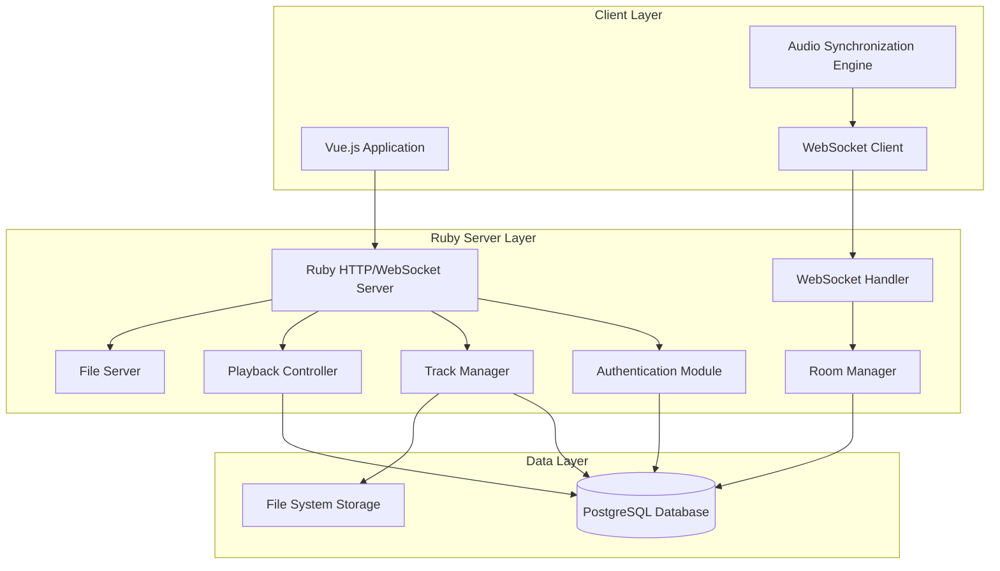

# Design Document: Ruby Backend Migration

## Overview

Данный документ описывает дизайн миграции существующего Laravel бэкенда приложения Spotik на Ruby с встроенными WebSocket'ами. Новая архитектура будет использовать Ruby как основной язык программирования с нативной поддержкой WebSocket соединений, обеспечивая лучшую производительность и упрощенную архитектуру по сравнению с текущим Laravel + Redis Broadcasting решением.

Основная цель - создать высокопроизводительный Ruby сервер, который будет полностью совместим с существующим фронтендом Vue.js, сохраняя все функциональные возможности оригинального приложения, но с улучшенной производительностью WebSocket коммуникации.

## Architecture

### High-Level Architecture



### Technology Stack

**Ruby Server:**
- Ruby 3.2+ - Основной язык программирования
- Iodine HTTP/WebSocket Server - Высокопроизводительный сервер с нативной поддержкой WebSocket
- Sinatra - Минималистичный веб-фреймворк для REST API
- Sequel ORM - Легковесная ORM для работы с PostgreSQL
- JWT - Аутентификация через JSON Web Tokens
- Rack - Стандартный интерфейс между веб-сервером и приложением

**Database & Storage:**
- PostgreSQL - Основная база данных (без изменений)
- File System - Прямое хранение файлов без Laravel Storage абстракции

**Removed Dependencies:**
- Redis - Больше не нужен для WebSocket broadcasting
- Laravel Broadcasting - Заменен на нативные WebSocket'ы
- PHP/Laravel - Полностью заменен на Ruby

### Server Architecture Design

#### Core Server Structure
Новый Ruby сервер будет построен на основе Iodine - высокопроизводительного HTTP/WebSocket сервера, который обеспечивает:

- **Нативные WebSocket'ы**: Встроенная поддержка без внешних зависимостей
- **Высокая производительность**: Способность обрабатывать 20K+ concurrent соединений
- **Многопоточность**: Эффективное использование CPU ресурсов
- **Pub/Sub система**: Встроенная система для broadcasting событий

#### Application Structure
```ruby
# Основная структура приложения
app/
├── server.rb              # Главный файл сервера
├── config/
│   ├── database.rb         # Конфигурация БД
│   └── settings.rb         # Общие настройки
├── models/
│   ├── user.rb            # Модель пользователя
│   ├── room.rb            # Модель комнаты
│   ├── track.rb           # Модель трека
│   └── track_vote.rb      # Модель голосования
├── controllers/
│   ├── auth_controller.rb  # Аутентификация
│   ├── room_controller.rb  # Управление комнатами
│   ├── track_controller.rb # Управление треками
│   └── file_controller.rb  # Загрузка файлов
├── websocket/
│   ├── connection.rb       # WebSocket соединения
│   ├── room_channel.rb     # Канал комнаты
│   └── events.rb          # События WebSocket
└── services/
    ├── auth_service.rb     # Сервис аутентификации
    ├── playback_service.rb # Сервис воспроизведения
    └── file_service.rb     # Сервис файлов
```

## Components and Interfaces

### Ruby Server Components

#### Main Server (server.rb)
Основной файл сервера, который инициализирует Iodine и настраивает маршруты.

```ruby
require 'iodine'
require 'sinatra/base'

class SpotikServer < Sinatra::Base
  # HTTP API маршруты
  post '/api/auth/login' do
    AuthController.login(params)
  end
  
  get '/api/rooms' do
    RoomController.index
  end
  
  # WebSocket upgrade
  get '/ws' do
    if env['rack.upgrade?'] == :websocket
      env['rack.upgrade'] = WebSocketConnection.new(env)
      [0, {}, []]
    else
      [400, {}, ['WebSocket required']]
    end
  end
end

# Запуск сервера
Iodine.listen service: :http, handler: SpotikServer
Iodine.start
```

#### Authentication Module
Обрабатывает аутентификацию пользователей и управление JWT токенами.

**Key Methods:**
- `authenticate(username, password)` - Аутентификация пользователя
- `generate_jwt(user_id)` - Генерация JWT токена
- `validate_jwt(token)` - Валидация JWT токена
- `register_user(user_data)` - Регистрация нового пользователя

```ruby
class AuthService
  def self.authenticate(username, password)
    user = User.find(username: username)
    return nil unless user && BCrypt::Password.new(user.password_hash) == password
    
    generate_jwt(user.id)
  end
  
  def self.generate_jwt(user_id)
    payload = { user_id: user_id, exp: Time.now.to_i + 3600 }
    JWT.encode(payload, JWT_SECRET, 'HS256')
  end
end
```

#### Room Manager
Управляет созданием, присоединением и состоянием комнат.

**Key Methods:**
- `create_room(user_id, room_data)` - Создание новой комнаты
- `join_room(user_id, room_id)` - Присоединение к комнате
- `leave_room(user_id, room_id)` - Покидание комнаты
- `get_room_state(room_id)` - Получение состояния комнаты
- `broadcast_to_room(room_id, event, data)` - Отправка события всем участникам

```ruby
class RoomManager
  def self.join_room(user_id, room_id)
    room = Room[room_id]
    return nil unless room
    
    # Добавляем пользователя в комнату
    room.add_participant(user_id)
    
    # Уведомляем всех участников
    broadcast_to_room(room_id, 'user_joined', {
      user_id: user_id,
      participants: room.participants
    })
    
    room
  end
  
  def self.broadcast_to_room(room_id, event, data)
    Iodine.publish("room_#{room_id}", {
      event: event,
      data: data,
      timestamp: Time.now.to_f
    }.to_json)
  end
end
```

#### Track Manager
Обрабатывает загрузку, хранение и управление треками.

**Key Methods:**
- `upload_track(user_id, room_id, file_data)` - Загрузка трека
- `get_track_queue(room_id)` - Получение очереди треков
- `vote_for_track(user_id, track_id)` - Голосование за трек
- `reorder_queue(room_id)` - Переупорядочивание очереди по голосам

#### Playback Controller
Управляет синхронизированным воспроизведением музыки.

**Key Methods:**
- `start_track(room_id, track_id)` - Начало воспроизведения
- `pause_track(room_id)` - Пауза воспроизведения
- `resume_track(room_id)` - Возобновление воспроизведения
- `skip_track(room_id)` - Пропуск трека
- `get_playback_position(room_id)` - Получение текущей позиции

```ruby
class PlaybackController
  def self.start_track(room_id, track_id)
    room = Room[room_id]
    track = Track[track_id]
    
    # Обновляем состояние комнаты
    room.update(
      current_track_id: track_id,
      playback_started_at: Time.now,
      is_playing: true,
      playback_paused_at: nil
    )
    
    # Уведомляем всех участников
    RoomManager.broadcast_to_room(room_id, 'playback_started', {
      track_id: track_id,
      track_data: track.to_hash,
      started_at: room.playback_started_at.to_f,
      server_time: Time.now.to_f
    })
  end
end
```

#### WebSocket Handler
Обрабатывает WebSocket соединения и события.

```ruby
class WebSocketConnection
  def initialize(env)
    @user_id = extract_user_from_token(env)
    @room_id = nil
  end
  
  def on_open(client)
    puts "WebSocket connected: user #{@user_id}"
  end
  
  def on_message(client, data)
    message = JSON.parse(data)
    
    case message['type']
    when 'join_room'
      join_room(client, message['room_id'])
    when 'vote_track'
      vote_track(client, message['track_id'])
    when 'playback_control'
      handle_playback_control(client, message)
    end
  end
  
  def on_close(client)
    leave_current_room if @room_id
  end
  
  private
  
  def join_room(client, room_id)
    @room_id = room_id
    client.subscribe("room_#{room_id}")
    RoomManager.join_room(@user_id, room_id)
  end
end
```

### Database Models

Используем существующую схему PostgreSQL без изменений, но с Sequel ORM вместо Eloquent.

#### User Model
```ruby
class User < Sequel::Model
  plugin :validation_helpers
  plugin :timestamps
  
  def validate
    super
    validates_presence [:username, :email, :password_hash]
    validates_unique :username
    validates_unique :email
  end
end
```

#### Room Model
```ruby
class Room < Sequel::Model
  plugin :validation_helpers
  plugin :timestamps
  
  one_to_many :tracks
  many_to_many :participants, class: :User, join_table: :room_participants
  
  def current_playback_position
    return 0 unless is_playing && playback_started_at
    
    if playback_paused_at
      (playback_paused_at - playback_started_at).to_f
    else
      (Time.now - playback_started_at).to_f
    end
  end
end
```

#### Track Model
```ruby
class Track < Sequel::Model
  plugin :validation_helpers
  plugin :timestamps
  
  many_to_one :room
  many_to_one :uploader, class: :User
  one_to_many :votes, class: :TrackVote
  
  def vote_score
    votes.count
  end
  
  def to_hash
    {
      id: id,
      filename: filename,
      original_name: original_name,
      duration_seconds: duration_seconds,
      vote_score: vote_score,
      uploader: uploader.username
    }
  end
end
```

### File Storage Strategy

Заменяем Laravel Storage на прямую работу с файловой системой:

```ruby
class FileService
  UPLOAD_DIR = './storage/tracks'
  
  def self.save_uploaded_file(file_data, user_id, room_id)
    # Генерируем уникальное имя файла
    filename = generate_filename(file_data[:filename])
    filepath = File.join(UPLOAD_DIR, filename)
    
    # Сохраняем файл
    File.open(filepath, 'wb') do |f|
      f.write(file_data[:tempfile].read)
    end
    
    # Получаем метаданные
    duration = get_audio_duration(filepath)
    file_size = File.size(filepath)
    
    {
      filename: filename,
      filepath: filepath,
      duration_seconds: duration,
      file_size_bytes: file_size,
      mime_type: file_data[:type]
    }
  end
  
  def self.serve_file(filename)
    filepath = File.join(UPLOAD_DIR, filename)
    return nil unless File.exist?(filepath)
    
    {
      content: File.read(filepath),
      content_type: get_mime_type(filename),
      content_length: File.size(filepath)
    }
  end
end
```

## WebSocket Event Architecture

### Native Pub/Sub Implementation

Используем встроенную Pub/Sub систему Iodine вместо Redis:

```ruby
# Подписка на события комнаты
client.subscribe("room_#{room_id}")

# Публикация события всем участникам комнаты
Iodine.publish("room_#{room_id}", event_data.to_json)
```

### Event Types and Payloads

#### User Events
```json
{
  "event": "user_joined",
  "room_id": "uuid",
  "data": {
    "user_id": "uuid",
    "username": "string",
    "participants": ["array of users"]
  },
  "timestamp": 1640995200.123
}
```

#### Track Events
```json
{
  "event": "track_added",
  "room_id": "uuid", 
  "data": {
    "track": {
      "id": "uuid",
      "filename": "song.mp3",
      "original_name": "My Song.mp3",
      "duration_seconds": 180,
      "uploader": "username",
      "vote_score": 0
    },
    "queue_position": 3
  },
  "timestamp": 1640995200.123
}
```

#### Playback Events
```json
{
  "event": "playback_started",
  "room_id": "uuid",
  "data": {
    "track_id": "uuid",
    "track_data": {
      "id": "uuid",
      "filename": "song.mp3",
      "duration_seconds": 180
    },
    "started_at": 1640995200.123,
    "server_time": 1640995200.123
  },
  "timestamp": 1640995200.123
}
```

### Connection Management

```ruby
class WebSocketConnection
  @@connections = {}
  
  def on_open(client)
    @@connections[@user_id] = client
    authenticate_connection(client)
  end
  
  def on_close(client)
    @@connections.delete(@user_id)
    cleanup_user_presence
  end
  
  def self.broadcast_to_user(user_id, message)
    client = @@connections[user_id]
    client&.write(message.to_json)
  end
end
```

## Audio Synchronization Strategy

Сохраняем ту же стратегию синхронизации, что и в Laravel версии, но с улучшенной производительностью:

### Server-Side Timing Authority
```ruby
class PlaybackController
  def self.get_current_position(room_id)
    room = Room[room_id]
    return 0 unless room.is_playing && room.playback_started_at
    
    if room.playback_paused_at
      (room.playback_paused_at - room.playback_started_at).to_f
    else
      (Time.now - room.playback_started_at).to_f
    end
  end
  
  def self.pause_track(room_id)
    room = Room[room_id]
    current_position = get_current_position(room_id)
    
    room.update(
      is_playing: false,
      playback_paused_at: Time.now
    )
    
    RoomManager.broadcast_to_room(room_id, 'playback_paused', {
      paused_at: Time.now.to_f,
      position: current_position
    })
  end
end
```

### Performance Improvements
- **Reduced Latency**: Прямая WebSocket коммуникация без Redis промежуточного слоя
- **Better Precision**: Более точные timestamps благодаря меньшему количеству промежуточных слоев
- **Lower Memory Usage**: Отсутствие Redis и Laravel overhead

## API Compatibility Layer

Обеспечиваем полную совместимость с существующим фронтендом:

### REST API Endpoints
```ruby
class SpotikServer < Sinatra::Base
  # Authentication
  post '/api/auth/login' do
    result = AuthService.authenticate(params[:username], params[:password])
    if result
      { token: result, user: User.find(username: params[:username]) }.to_json
    else
      status 401
      { error: 'Invalid credentials' }.to_json
    end
  end
  
  # Rooms
  get '/api/rooms' do
    authenticate_request!
    Room.all.map(&:to_hash).to_json
  end
  
  post '/api/rooms' do
    authenticate_request!
    room = RoomManager.create_room(current_user.id, JSON.parse(request.body.read))
    room.to_hash.to_json
  end
  
  # File upload
  post '/api/rooms/:room_id/tracks' do
    authenticate_request!
    file_data = params[:file]
    track = TrackManager.upload_track(current_user.id, params[:room_id], file_data)
    track.to_hash.to_json
  end
end
```

### Response Format Compatibility
Обеспечиваем те же форматы JSON ответов:

```ruby
class Room < Sequel::Model
  def to_hash
    {
      id: id,
      name: name,
      administrator_id: administrator_id,
      current_track: current_track&.to_hash,
      participants: participants.map { |p| { id: p.id, username: p.username } },
      is_playing: is_playing,
      created_at: created_at.iso8601,
      updated_at: updated_at.iso8601
    }
  end
end
```

## Performance Optimizations

### Connection Pooling
```ruby
# Настройка пула соединений с БД
DB = Sequel.connect(
  adapter: 'postgres',
  host: ENV['DB_HOST'],
  database: ENV['DB_NAME'],
  user: ENV['DB_USER'],
  password: ENV['DB_PASSWORD'],
  max_connections: 20,
  pool_timeout: 5
)
```

### Memory Management
```ruby
# Настройка Iodine для оптимальной производительности
Iodine.threads = ENV['THREADS']&.to_i || 4
Iodine.workers = ENV['WORKERS']&.to_i || 2

# Включение оптимизации памяти
Iodine.listen(
  service: :http,
  handler: SpotikServer,
  port: ENV['PORT'] || 3000,
  public: './public'  # Статические файлы
)
```

### Caching Strategy
```ruby
class RoomManager
  @@room_cache = {}
  
  def self.get_room_state(room_id)
    # Кэшируем состояние комнаты на 1 секунду
    cache_key = "room_#{room_id}"
    cached = @@room_cache[cache_key]
    
    if cached && (Time.now - cached[:timestamp]) < 1
      return cached[:data]
    end
    
    room_state = Room[room_id].to_hash
    @@room_cache[cache_key] = {
      data: room_state,
      timestamp: Time.now
    }
    
    room_state
  end
end
```

Теперь выполню prework анализ для создания correctness properties.

## Correctness Properties

*A property is a characteristic or behavior that should hold true across all valid executions of a system—essentially, a formal statement about what the system should do. Properties serve as the bridge between human-readable specifications and machine-verifiable correctness guarantees.*

На основе анализа требований, следующие свойства обеспечивают корректность Ruby миграции системы Spotik:

### Property 1: WebSocket Connection Support
*For any* client attempting to establish a WebSocket connection, the system should successfully accept the connection and provide bidirectional communication capabilities.
**Validates: Requirements 1.2, 7.2**

### Property 2: HTTP API Compatibility
*For any* HTTP request that was valid in the Legacy_System, the Ruby system should return an equivalent response with the same status code, headers, and JSON format.
**Validates: Requirements 1.3, 9.1, 9.2, 9.3, 9.4, 9.5**

### Property 3: Authentication Compatibility
*For any* valid user credentials that worked in the Legacy_System, the Ruby system should authenticate the user and generate a compatible JWT token.
**Validates: Requirements 2.1, 2.3**

### Property 4: JWT Token Management
*For any* JWT token generated by the system, it should be valid for authentication until expiration, and expired tokens should be rejected.
**Validates: Requirements 2.2, 2.4, 2.5**

### Property 5: Room Membership Management
*For any* user joining or leaving a room, the system should correctly update the participant list and maintain accurate room state.
**Validates: Requirements 3.1, 3.2, 3.3, 3.4**

### Property 6: Audio File Upload and Validation
*For any* audio file upload attempt, the system should accept valid formats (MP3, WAV, M4A) and reject invalid files with appropriate error messages.
**Validates: Requirements 4.1, 4.2, 4.4**

### Property 7: Track Queue Management
*For any* successfully uploaded track, the system should add it to the room's queue and maintain proper queue ordering based on votes and upload time.
**Validates: Requirements 4.3, 6.3**

### Property 8: Synchronized Playback Control
*For any* playback control action (play, pause, resume, skip) by a room administrator, the system should update the room state and broadcast the change to all participants with accurate timestamps.
**Validates: Requirements 5.1, 5.2, 5.3, 5.4**

### Property 9: Voting System Integrity
*For any* vote cast or removed by a user, the system should correctly update the track's vote count and reorder the queue accordingly.
**Validates: Requirements 6.1, 6.2**

### Property 10: Real-time Event Broadcasting
*For any* significant room event (user join/leave, track addition, voting, playback changes), the system should broadcast the event to all room participants via WebSocket within a reasonable time window.
**Validates: Requirements 3.5, 4.5, 5.5, 6.4, 6.5, 11.1, 11.2, 11.3, 11.4**

### Property 11: WebSocket Authentication
*For any* WebSocket connection attempt, the system should authenticate the connection using a valid JWT token and reject connections with invalid or missing tokens.
**Validates: Requirements 7.3**

### Property 12: Connection Cleanup
*For any* WebSocket connection that is terminated, the system should properly clean up resources and update room state to reflect the user's departure.
**Validates: Requirements 7.5**

### Property 13: Database Compatibility
*For any* CRUD operation that worked with the Legacy_System database, the Ruby system should perform the same operation with identical results and maintain data integrity.
**Validates: Requirements 8.3, 8.5**

### Property 14: File Storage Compatibility
*For any* audio file request, the system should serve existing files from the Legacy_System storage and save new files in the same format and directory structure.
**Validates: Requirements 10.1, 10.2, 10.3, 10.5**

### Property 15: File Access Control
*For any* file access request, the system should verify user permissions before serving the file and deny access to unauthorized users.
**Validates: Requirements 10.4**

### Property 16: Performance Improvement
*For any* comparable operation (WebSocket latency, concurrent connections, memory usage), the Ruby system should perform equal to or better than the Legacy_System.
**Validates: Requirements 12.1, 12.2, 12.3, 12.4**

### Property 17: Error Handling and Logging
*For any* error condition or significant system event, the system should log appropriate information and return user-friendly error messages without crashing.
**Validates: Requirements 13.1, 13.2, 13.3, 13.4, 13.5**

### Property 18: Configuration Management
*For any* configuration parameter (database connection, server ports, file paths), the system should read values from configuration files or environment variables and validate them at startup.
**Validates: Requirements 14.1, 14.2, 14.5**

### Property 19: Legacy System Test Compatibility
*For any* test case that passed in the Legacy_System, the Ruby system should produce equivalent results, demonstrating functional compatibility.
**Validates: Requirements 15.1, 15.2, 15.3, 15.4, 15.5**

## Error Handling

### Migration-Specific Error Handling

#### Database Connection Errors
- **Connection Failures**: Retry with exponential backoff, log detailed error information
- **Schema Incompatibility**: Validate schema on startup, fail fast with clear error messages
- **Data Migration Issues**: Provide rollback mechanisms and data validation

#### WebSocket Migration Errors
- **Protocol Incompatibility**: Ensure WebSocket message formats match Legacy_System exactly
- **Connection Limits**: Handle graceful degradation when connection limits are reached
- **Broadcasting Failures**: Implement message queuing for failed broadcasts

#### File System Migration Errors
- **File Access Permissions**: Validate file system permissions on startup
- **Storage Path Changes**: Support configurable storage paths for different environments
- **File Format Compatibility**: Validate audio file metadata compatibility

#### Performance Degradation
- **Memory Leaks**: Implement memory monitoring and automatic cleanup
- **Connection Pool Exhaustion**: Monitor and alert on connection pool usage
- **CPU Overload**: Implement request throttling and load balancing

### Backward Compatibility Error Handling
```ruby
class CompatibilityError < StandardError
  attr_reader :legacy_behavior, :current_behavior
  
  def initialize(message, legacy_behavior: nil, current_behavior: nil)
    super(message)
    @legacy_behavior = legacy_behavior
    @current_behavior = current_behavior
  end
end

# Использование в коде
def ensure_compatibility(operation, expected_result)
  result = operation.call
  unless result == expected_result
    raise CompatibilityError.new(
      "Operation result differs from Legacy_System",
      legacy_behavior: expected_result,
      current_behavior: result
    )
  end
  result
end
```

## Testing Strategy

### Dual Testing Approach
Система требует как unit тестирования, так и property-based тестирования для полного покрытия:

**Unit Tests** фокусируются на:
- Специфических сценариях миграции (совместимость JWT токенов, формат API ответов)
- Граничных случаях WebSocket соединений (разрывы соединения, неверные сообщения)
- Совместимости файлового хранилища (существующие файлы, новые загрузки)
- Обработке ошибок миграции (несовместимые данные, отсутствующие файлы)

**Property-Based Tests** фокусируются на:
- Универсальных свойствах совместимости (любой валидный запрос Legacy_System)
- Комплексном покрытии через рандомизацию (различные пользователи, комнаты, файлы)
- Производительности при различных нагрузках (concurrent соединения, большие файлы)
- Целостности данных при concurrent операциях

### Property-Based Testing Configuration
- **Testing Library**: Ruby использует RSpec с gem 'rantly' для property-based тестирования
- **Frontend Testing**: Существующие Vue Test Utils тесты должны проходить без изменений
- **Test Iterations**: Минимум 100 итераций на property тест
- **Test Tagging**: Каждый property тест помечается форматом: **Feature: ruby-backend-migration, Property {number}: {property_text}**

### Migration-Specific Testing

#### Compatibility Testing
```ruby
# Пример property теста для совместимости API
RSpec.describe "API Compatibility" do
  it "maintains Legacy_System API compatibility" do
    property_of {
      user = generate_user
      room = generate_room
      endpoint = choose_api_endpoint
      params = generate_valid_params_for(endpoint)
    }.check { |user, room, endpoint, params|
      # Выполняем запрос к Ruby системе
      ruby_response = make_request(endpoint, params, user.token)
      
      # Сравниваем с ожидаемым форматом Legacy_System
      expect(ruby_response.status).to eq(expected_status_for(endpoint, params))
      expect(ruby_response.body).to match_legacy_format(endpoint)
      expect(ruby_response.headers).to include_required_headers
    }
  end
end
```

#### Performance Comparison Testing
```ruby
RSpec.describe "Performance Improvements" do
  it "WebSocket latency is equal or better than Legacy_System" do
    property_of {
      room = create_room_with_participants(rand(2..10))
      message = generate_websocket_message
    }.check { |room, message|
      # Измеряем время отправки и получения сообщения
      start_time = Time.now
      broadcast_message(room.id, message)
      end_time = wait_for_all_participants_to_receive(message)
      
      latency = end_time - start_time
      expect(latency).to be <= LEGACY_SYSTEM_MAX_LATENCY
    }
  end
end
```

#### Data Integrity Testing
```ruby
RSpec.describe "Database Compatibility" do
  it "maintains data integrity across all operations" do
    property_of {
      operation = choose_database_operation
      data = generate_test_data_for(operation)
    }.check { |operation, data|
      # Выполняем операцию
      result = perform_operation(operation, data)
      
      # Проверяем целостность данных
      expect(database_constraints_satisfied?).to be true
      expect(referential_integrity_maintained?).to be true
      expect(result).to match_legacy_system_behavior(operation, data)
    }
  end
end
```

### Integration Testing

#### End-to-End Migration Testing
- **Complete User Workflows**: Полные пользовательские сценарии от аутентификации до синхронизированного прослушивания
- **WebSocket Integration**: Real-time доставка событий и синхронизация клиентов
- **Cross-System Testing**: Совместимость между Legacy_System клиентами и Ruby сервером
- **Load Testing**: Множественные concurrent комнаты с синхронизированным воспроизведением

#### Migration Validation Testing
- **Data Migration Verification**: Проверка корректности миграции существующих данных
- **File System Compatibility**: Проверка доступности существующих аудио файлов
- **API Endpoint Parity**: Сравнение всех API endpoints с Legacy_System
- **WebSocket Event Compatibility**: Проверка совместимости всех WebSocket событий

### Performance Testing

#### Comparative Benchmarking
```ruby
# Бенчмарк для сравнения производительности
require 'benchmark'

def compare_websocket_performance
  Benchmark.bm(20) do |x|
    x.report("Legacy System:") { benchmark_legacy_websockets }
    x.report("Ruby System:") { benchmark_ruby_websockets }
  end
end

def benchmark_ruby_websockets
  # Создаем 1000 WebSocket соединений
  connections = 1000.times.map { create_websocket_connection }
  
  # Измеряем время отправки сообщения всем соединениям
  start_time = Time.now
  broadcast_to_all_connections(connections, test_message)
  wait_for_all_to_receive
  end_time = Time.now
  
  cleanup_connections(connections)
  end_time - start_time
end
```

#### Resource Usage Testing
- **Memory Usage**: Сравнение потребления памяти при различных нагрузках
- **CPU Utilization**: Измерение использования CPU при concurrent операциях
- **Connection Scalability**: Тестирование максимального количества WebSocket соединений
- **Database Performance**: Сравнение производительности запросов к базе данных