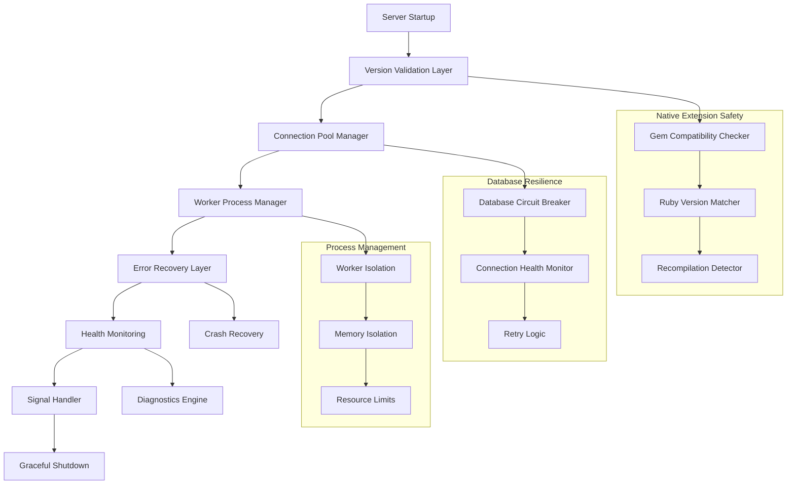

# Design Document

## Overview

The Ruby backend stability fix addresses critical server crashes caused by Ruby version mismatches, native extension incompatibilities, and inadequate error handling. The solution implements a multi-layered approach including version validation, enhanced error recovery, robust connection pooling, and graceful shutdown mechanisms.

The design focuses on preventing segmentation faults in the pg gem, implementing proper signal handling, and creating resilient worker processes that can recover from errors without affecting overall system stability.

## Architecture

The stability fix follows a defensive programming approach with multiple layers of protection:



### Key Architectural Principles

1. **Fail-Safe Design**: Each component has fallback mechanisms to prevent cascading failures
2. **Isolation**: Database connections, worker processes, and error handling are isolated to prevent cross-contamination
3. **Observability**: Comprehensive logging and monitoring at every layer
4. **Graceful Degradation**: System continues operating with reduced functionality rather than crashing

## Components and Interfaces

### Version Validation Component

**Purpose**: Ensures Ruby version consistency across runtime and compiled gems

**Interface**:
```ruby
class VersionValidator
  def self.validate_ruby_consistency
  def self.check_native_extensions
  def self.generate_recompilation_commands
  def self.validate_gem_compatibility(gem_name, version)
end
```

**Key Methods**:
- `validate_ruby_consistency`: Compares runtime Ruby version with gem compilation versions
- `check_native_extensions`: Validates native extensions can load without segfaults
- `generate_recompilation_commands`: Provides specific commands to fix version mismatches

### Enhanced Database Connection Manager

**Purpose**: Provides robust database connectivity with circuit breaker patterns

**Interface**:
```ruby
class EnhancedDatabaseManager
  def self.establish_safe_connection
  def self.test_connection_safety
  def self.handle_connection_failure(error)
  def self.get_connection_health_status
end
```

**Key Features**:
- Connection pool isolation to prevent worker contamination
- Circuit breaker pattern for persistent failures
- Safe connection testing that doesn't crash workers
- Exponential backoff retry logic

### Worker Process Manager

**Purpose**: Manages worker lifecycle with crash recovery and resource monitoring

**Interface**:
```ruby
class WorkerProcessManager
  def self.monitor_worker_health
  def self.handle_worker_crash(worker_id, error)
  def self.restart_worker_with_backoff(worker_id)
  def self.check_memory_usage(worker_id)
end
```

**Key Features**:
- Automatic worker respawning with crash tracking
- Memory usage monitoring and proactive restarts
- Cascade failure prevention with backoff delays

### Signal Handler Component

**Purpose**: Implements graceful shutdown without trap context errors

**Interface**:
```ruby
class GracefulSignalHandler
  def self.setup_signal_handlers
  def self.initiate_graceful_shutdown
  def self.cleanup_resources
  def self.force_shutdown_after_timeout
end
```

**Key Features**:
- Proper signal handling outside trap context
- Resource cleanup with timeout protection
- Connection draining during shutdown

### Error Recovery System

**Purpose**: Comprehensive error handling with crash prevention and diagnostics

**Interface**:
```ruby
class ErrorRecoverySystem
  def self.handle_segmentation_fault(error)
  def self.capture_system_state
  def self.implement_circuit_breaker(operation)
  def self.generate_diagnostic_report
end
```

**Key Features**:
- Segmentation fault detection and logging
- System state capture for debugging
- Circuit breaker implementation for critical operations

### Health Monitoring Engine

**Purpose**: Proactive monitoring and diagnostics for stability issues

**Interface**:
```ruby
class HealthMonitoringEngine
  def self.check_system_stability
  def self.validate_gem_health
  def self.monitor_connection_pools
  def self.generate_stability_report
end
```

**Key Features**:
- Ruby version consistency monitoring
- Connection pool health validation
- Worker crash rate tracking
- Actionable diagnostic reporting

## Data Models

### System Health Status

```ruby
class SystemHealthStatus
  attr_accessor :ruby_version_consistent
  attr_accessor :native_extensions_healthy
  attr_accessor :database_connections_stable
  attr_accessor :worker_processes_healthy
  attr_accessor :error_rate_acceptable
  attr_accessor :last_stability_check
  attr_accessor :diagnostic_messages
end
```

### Connection Pool Health

```ruby
class ConnectionPoolHealth
  attr_accessor :pool_size
  attr_accessor :active_connections
  attr_accessor :failed_connections
  attr_accessor :circuit_breaker_state
  attr_accessor :last_connection_test
  attr_accessor :average_response_time
end
```

### Worker Process Status

```ruby
class WorkerProcessStatus
  attr_accessor :worker_id
  attr_accessor :process_id
  attr_accessor :memory_usage_mb
  attr_accessor :crash_count
  attr_accessor :last_restart_time
  attr_accessor :health_status
  attr_accessor :error_history
end
```

### Gem Compatibility Report

```ruby
class GemCompatibilityReport
  attr_accessor :gem_name
  attr_accessor :installed_version
  attr_accessor :ruby_version_compiled_for
  attr_accessor :current_ruby_version
  attr_accessor :compatibility_status
  attr_accessor :recompilation_required
  attr_accessor :recompilation_command
end
```

## Correctness Properties

*A property is a characteristic or behavior that should hold true across all valid executions of a system-essentially, a formal statement about what the system should do. Properties serve as the bridge between human-readable specifications and machine-verifiable correctness guarantees.*

### Property 1: Ruby Version Consistency Validation
*For any* Ruby backend startup with installed gems, the version validator should reject any gem compiled for a different Ruby version than the current runtime
**Validates: Requirements 1.1, 1.4, 7.1**

### Property 2: Version Mismatch Logging and Exit
*For any* detected Ruby version mismatch, the system should log detailed version information and exit gracefully with appropriate status codes
**Validates: Requirements 1.2**

### Property 3: Recompilation Command Generation
*For any* gem with version compatibility issues, the system should generate specific, actionable recompilation commands
**Validates: Requirements 1.3, 7.3**

### Property 4: Production Validation Sequence
*For any* production startup, gem integrity validation should complete successfully before the server accepts any connections
**Validates: Requirements 1.5**

### Property 5: Connection Pool Timeout Handling
*For any* database connection request, the connection pool should respect configured timeouts and handle pool exhaustion gracefully
**Validates: Requirements 2.1, 8.1**

### Property 6: Database Connection Retry with Backoff
*For any* failed database connection, the system should implement exponential backoff retry logic without crashing worker processes
**Validates: Requirements 2.2, 8.3**

### Property 7: Connection Pool Graceful Queuing
*For any* connection pool exhaustion scenario, requests should be queued gracefully rather than causing segmentation faults
**Validates: Requirements 2.3**

### Property 8: Health Check Isolation
*For any* database health check operation, the testing should be isolated to prevent worker crashes while providing accurate status
**Validates: Requirements 2.4**

### Property 9: Circuit Breaker Implementation
*For any* persistent database or system failures, the circuit breaker should open after threshold failures and prevent further attempts until recovery
**Validates: Requirements 2.5, 5.3**

### Property 10: Segmentation Fault Recovery
*For any* native extension operation that could cause segmentation faults, the error recovery system should catch and handle them gracefully
**Validates: Requirements 2.6**

### Property 11: Worker Process Isolation
*For any* worker process crash or exception, the error should be contained to that worker without affecting other workers
**Validates: Requirements 3.1, 3.4**

### Property 12: Automatic Worker Management
*For any* worker crash scenario, the system should automatically restart the worker with crash tracking and implement backoff delays for rapid failures
**Validates: Requirements 3.2, 3.3, 3.5**

### Property 13: Signal Handler Graceful Shutdown
*For any* SIGINT or SIGTERM signal, the signal handler should initiate graceful shutdown without trap context errors
**Validates: Requirements 4.1**

### Property 14: Resource Cleanup During Shutdown
*For any* shutdown sequence, all database connections should be closed cleanly and pending operations completed within timeout limits
**Validates: Requirements 4.2, 4.3**

### Property 15: Connection Management During Shutdown
*For any* shutdown process, new connections should be rejected while existing requests complete gracefully
**Validates: Requirements 4.4**

### Property 16: Shutdown Exit Codes
*For any* shutdown scenario, the system should exit with appropriate status codes indicating the shutdown reason
**Validates: Requirements 4.5**

### Property 17: Error State Capture
*For any* segmentation fault or critical error, the error recovery system should capture stack traces and system state before termination
**Validates: Requirements 5.1**

### Property 18: Native Extension Error Diagnostics
*For any* native extension error, the system should provide gem version and compilation diagnostic information
**Validates: Requirements 5.2**

### Property 19: Structured Error Logging
*For any* error condition, the error recovery system should log structured, parseable error information for debugging and monitoring
**Validates: Requirements 5.4**

### Property 20: Graceful Degradation
*For any* critical error, the system should attempt graceful degradation before complete failure
**Validates: Requirements 5.5**

### Property 21: Comprehensive Health Monitoring
*For any* health check execution, the system should validate Ruby version consistency, track worker statistics, and provide detailed diagnostics
**Validates: Requirements 6.1, 6.3, 6.4**

### Property 22: Non-Intrusive Performance Monitoring
*For any* database connection monitoring, health checks should not impact system performance
**Validates: Requirements 6.2**

### Property 23: Actionable Remediation Guidance
*For any* detected stability issue, the health check system should provide specific, actionable remediation steps
**Validates: Requirements 6.5**

### Property 24: Gem Installation Validation
*For any* gem installation, the system should verify compilation compatibility before allowing usage
**Validates: Requirements 7.2**

### Property 25: Critical Gem Compatibility Matrix
*For any* critical gem (pg, iodine, bcrypt), the system should maintain accurate compatibility information and validate against it
**Validates: Requirements 7.4**

### Property 26: Container Environment Validation
*For any* containerized deployment, the system should validate Ruby environment consistency across the container
**Validates: Requirements 7.5**

### Property 27: Connection Freshness Management
*For any* database connection, the connection pool should detect stale connections and refresh them automatically
**Validates: Requirements 8.2**

### Property 28: Proactive Connection Health Management
*For any* connection pool, unhealthy connections should be detected and replaced preemptively, with detailed diagnostics provided during pool exhaustion
**Validates: Requirements 8.4, 8.5**

## Error Handling

The error handling strategy implements multiple layers of protection:

### Segmentation Fault Protection
- Native extension operations wrapped in error recovery blocks
- System state capture before termination
- Graceful fallback to alternative implementations where possible

### Database Error Resilience
- Connection pool isolation prevents cross-worker contamination
- Circuit breaker pattern prevents cascade failures
- Exponential backoff retry logic with maximum attempt limits

### Worker Process Error Isolation
- Each worker process operates in isolation
- Automatic crash detection and restart mechanisms
- Memory usage monitoring with proactive restart thresholds

### Signal Handling Robustness
- Signal handlers operate outside trap context to prevent logging errors
- Graceful shutdown sequence with timeout protection
- Resource cleanup with proper ordering

## Testing Strategy

The testing strategy employs both unit tests and property-based tests to ensure comprehensive coverage:

### Property-Based Testing
- **Universal Properties**: Each correctness property will be implemented as a property-based test running minimum 100 iterations
- **Test Configuration**: Property tests will use the Rantly gem for Ruby property-based testing
- **Tag Format**: Each test tagged as **Feature: ruby-backend-stability-fix, Property {number}: {property_text}**

### Unit Testing Focus
- **Specific Examples**: Test concrete scenarios like specific Ruby version mismatches
- **Edge Cases**: Test boundary conditions like connection pool exhaustion
- **Integration Points**: Test interactions between components like signal handlers and database cleanup
- **Error Conditions**: Test specific error scenarios and recovery mechanisms

### Test Environment Setup
- **Isolated Testing**: Each test runs in isolation to prevent cross-test contamination
- **Mock Native Extensions**: Use test doubles for native extensions to simulate failures safely
- **Database Test Isolation**: Use separate test databases or in-memory databases for connection testing
- **Signal Testing**: Use controlled signal simulation to test shutdown behavior

### Complementary Testing Approach
- **Property Tests**: Validate universal behaviors across all inputs (e.g., version validation works for any gem)
- **Unit Tests**: Validate specific scenarios and edge cases (e.g., specific pg gem version mismatch)
- **Integration Tests**: Validate component interactions (e.g., worker restart triggers health check updates)

The combination ensures both broad correctness validation through property testing and specific scenario coverage through unit testing.