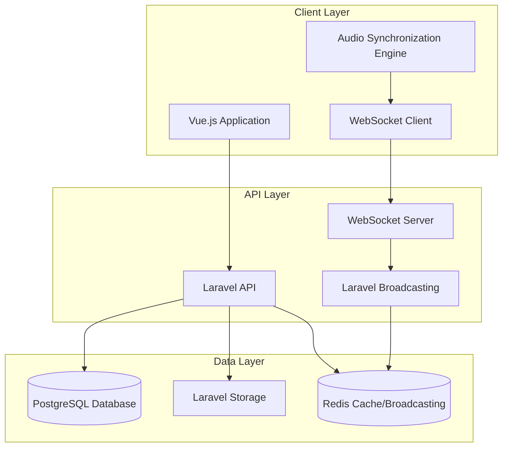

# Design Document: Spotik MVP

## Overview

Spotik is a collaborative music streaming web application that enables synchronized music listening across multiple users in shared rooms. The system consists of a Laravel API backend with WebSocket broadcasting capabilities and a Vue.js frontend with real-time audio synchronization.

The architecture follows a client-server model where the backend serves as the source of truth for all playback timing and room state, while clients synchronize their audio playback based on server-provided timestamps. Real-time communication is handled through WebSocket connections using Laravel Broadcasting with Redis as the message broker.

## Architecture

### High-Level Architecture



### Technology Stack

**Backend:**
- Laravel 12 (API mode) - RESTful API and WebSocket broadcasting
- PostgreSQL - Primary data storage for users, rooms, tracks, votes
- Redis - WebSocket message broadcasting and real-time state caching
- Laravel Storage - Audio file storage and serving
- JWT Authentication - Stateless user authentication

**Frontend:**
- Vue 3 (Composition API) - Reactive user interface
- Pinia - State management for application data
- Vue Router - Client-side routing
- HTMLAudioElement - Audio playback with precise timing control
- WebSocket Client - Real-time communication with backend

**Infrastructure:**
- Docker - Containerization for all services
- docker-compose - Multi-container orchestration
- Nginx - Web server and reverse proxy (production)

## Components and Interfaces

### Backend Components

#### Authentication Service
Handles user registration, login, and JWT token management.

**Key Methods:**
- `register(userData)` - Creates new user account
- `login(credentials)` - Authenticates user and returns JWT
- `validateToken(token)` - Validates JWT for protected routes

#### Room Service
Manages room creation, joining, leaving, and participant tracking.

**Key Methods:**
- `createRoom(userId, roomData)` - Creates new room with user as administrator
- `joinRoom(userId, roomId)` - Adds user to room participant list
- `leaveRoom(userId, roomId)` - Removes user from room
- `getRoomParticipants(roomId)` - Returns current participant list

#### Track Service
Handles audio file uploads, storage, and track queue management.

**Key Methods:**
- `uploadTrack(userId, roomId, audioFile)` - Stores audio file and adds to queue
- `getTrackQueue(roomId)` - Returns ordered track queue for room
- `removeTrack(trackId, userId)` - Removes track from queue (admin only)

#### Voting Service
Manages track voting and queue reordering based on scores.

**Key Methods:**
- `voteForTrack(userId, trackId)` - Adds or removes user vote for track
- `getTrackScore(trackId)` - Returns current vote count for track
- `reorderQueue(roomId)` - Sorts queue by score then upload time

#### Playback Service
Controls synchronized playback state across all room participants.

**Key Methods:**
- `startTrack(roomId, trackId, timestamp)` - Begins track playback
- `pauseTrack(roomId, timestamp)` - Pauses current track
- `resumeTrack(roomId, timestamp)` - Resumes paused track
- `skipTrack(roomId)` - Moves to next track in queue

#### Broadcasting Service
Handles real-time WebSocket event broadcasting to room participants.

**Events:**
- `UserJoined` - User joins room
- `UserLeft` - User leaves room
- `TrackAdded` - New track added to queue
- `TrackVoted` - Track receives vote
- `PlaybackStarted` - Track playback begins
- `PlaybackPaused` - Track playback paused
- `PlaybackResumed` - Track playback resumed
- `TrackSkipped` - Track skipped to next

### Frontend Components

#### Authentication Store (Pinia)
Manages user authentication state and API interactions.

**State:**
- `user` - Current authenticated user data
- `token` - JWT authentication token
- `isAuthenticated` - Boolean authentication status

#### Room Store (Pinia)
Manages current room state and participant data.

**State:**
- `currentRoom` - Active room information
- `participants` - List of room participants
- `isRoomAdmin` - Boolean indicating admin status

#### Track Store (Pinia)
Manages track queue and voting state.

**State:**
- `trackQueue` - Ordered list of tracks in queue
- `currentTrack` - Currently playing track
- `userVotes` - User's votes for tracks

#### Audio Synchronization Engine
Handles precise audio playback synchronization across clients.

**Key Methods:**
- `syncToServerTime(serverTimestamp, trackPosition)` - Synchronizes local playback
- `calculatePlaybackPosition(startTime, currentTime)` - Computes current position
- `handlePlaybackEvent(event)` - Processes WebSocket playback events

#### WebSocket Manager
Manages WebSocket connection and event handling.

**Key Methods:**
- `connect(roomId)` - Establishes WebSocket connection for room
- `disconnect()` - Closes WebSocket connection
- `subscribeToEvents(callbacks)` - Registers event handlers

## Data Models

### User Model
```sql
users (
    id: UUID PRIMARY KEY,
    username: VARCHAR(50) UNIQUE NOT NULL,
    email: VARCHAR(255) UNIQUE NOT NULL,
    password_hash: VARCHAR(255) NOT NULL,
    created_at: TIMESTAMP DEFAULT NOW(),
    updated_at: TIMESTAMP DEFAULT NOW()
)
```

### Room Model
```sql
rooms (
    id: UUID PRIMARY KEY,
    name: VARCHAR(100) NOT NULL,
    administrator_id: UUID REFERENCES users(id),
    current_track_id: UUID REFERENCES tracks(id) NULL,
    playback_started_at: TIMESTAMP NULL,
    playback_paused_at: TIMESTAMP NULL,
    is_playing: BOOLEAN DEFAULT FALSE,
    created_at: TIMESTAMP DEFAULT NOW(),
    updated_at: TIMESTAMP DEFAULT NOW()
)
```

### Track Model
```sql
tracks (
    id: UUID PRIMARY KEY,
    room_id: UUID REFERENCES rooms(id),
    uploader_id: UUID REFERENCES users(id),
    filename: VARCHAR(255) NOT NULL,
    original_name: VARCHAR(255) NOT NULL,
    file_path: VARCHAR(500) NOT NULL,
    duration_seconds: INTEGER NOT NULL,
    file_size_bytes: BIGINT NOT NULL,
    mime_type: VARCHAR(100) NOT NULL,
    vote_score: INTEGER DEFAULT 0,
    created_at: TIMESTAMP DEFAULT NOW(),
    updated_at: TIMESTAMP DEFAULT NOW()
)
```

### Room Participant Model
```sql
room_participants (
    id: UUID PRIMARY KEY,
    room_id: UUID REFERENCES rooms(id),
    user_id: UUID REFERENCES users(id),
    joined_at: TIMESTAMP DEFAULT NOW(),
    UNIQUE(room_id, user_id)
)
```

### Track Vote Model
```sql
track_votes (
    id: UUID PRIMARY KEY,
    track_id: UUID REFERENCES tracks(id),
    user_id: UUID REFERENCES users(id),
    created_at: TIMESTAMP DEFAULT NOW(),
    UNIQUE(track_id, user_id)
)
```

### Database Indexes
```sql
-- Performance indexes for common queries
CREATE INDEX idx_rooms_administrator ON rooms(administrator_id);
CREATE INDEX idx_tracks_room_score ON tracks(room_id, vote_score DESC, created_at ASC);
CREATE INDEX idx_room_participants_room ON room_participants(room_id);
CREATE INDEX idx_track_votes_track ON track_votes(track_id);
CREATE INDEX idx_track_votes_user ON track_votes(user_id);
```

## Audio Synchronization Strategy

### Server-Side Timing Authority
The backend maintains authoritative timing information for all playback events:

1. **Track Start**: Server records `playback_started_at` timestamp when track begins
2. **Pause Events**: Server records `playback_paused_at` timestamp when paused
3. **Resume Events**: Server updates `playback_started_at` accounting for pause duration
4. **Position Calculation**: `current_position = now() - playback_started_at`

### Client-Side Synchronization
Frontend clients synchronize their audio playback using server timestamps:

```javascript
// Synchronization algorithm
function syncAudioToServer(serverStartTime, serverCurrentTime) {
    const serverPosition = (serverCurrentTime - serverStartTime) / 1000; // seconds
    const localAudio = document.getElementById('audio-player');
    
    // Account for network latency and processing time
    const syncTolerance = 0.1; // 100ms tolerance
    const positionDiff = Math.abs(localAudio.currentTime - serverPosition);
    
    if (positionDiff > syncTolerance) {
        localAudio.currentTime = serverPosition;
    }
}
```

### Handling Network Latency
- Clients periodically sync with server time to account for clock drift
- WebSocket events include server timestamps for precise synchronization
- Tolerance window (100ms) prevents excessive seeking due to minor timing differences

## WebSocket Event Architecture

### Event Broadcasting Flow
1. User action triggers Laravel event (e.g., track upload, vote, playback control)
2. Event is broadcast to Redis via Laravel Broadcasting
3. WebSocket server receives event from Redis
4. Event is pushed to all subscribed clients in the room
5. Clients update their local state and UI accordingly

### Event Payload Structure
```javascript
// Example: Track playback started event
{
    event: 'PlaybackStarted',
    room_id: 'uuid',
    track_id: 'uuid',
    started_at: '2024-01-15T10:30:00.000Z',
    server_time: '2024-01-15T10:30:00.000Z',
    track_data: {
        id: 'uuid',
        filename: 'song.mp3',
        duration: 180,
        uploader: 'username'
    }
}
```

### Connection Management
- Each client maintains one WebSocket connection per room
- Connections are authenticated using JWT tokens
- Automatic reconnection with exponential backoff on connection loss
- Heartbeat mechanism to detect and handle stale connections

## Correctness Properties

*A property is a characteristic or behavior that should hold true across all valid executions of a system—essentially, a formal statement about what the system should do. Properties serve as the bridge between human-readable specifications and machine-verifiable correctness guarantees.*

Based on the requirements analysis, the following properties ensure the correctness of the Spotik system:

### Property 1: User Registration and Authentication
*For any* valid user registration data, the system should create a new user account and allow subsequent authentication with those credentials.
**Validates: Requirements 1.1, 1.2**

### Property 2: Invalid Authentication Rejection
*For any* invalid login credentials (wrong password, non-existent user, malformed data), the system should reject the authentication attempt and return an appropriate error.
**Validates: Requirements 1.3**

### Property 3: JWT Token Management
*For any* successful authentication, the system should return a valid JWT token that can be used for subsequent authenticated requests until expiration.
**Validates: Requirements 1.4, 1.5**

### Property 4: Room Creation and Administration
*For any* authenticated user creating a room, the system should establish a new room with that user as the Room_Administrator and grant them exclusive playback control privileges.
**Validates: Requirements 2.1, 6.4**

### Property 5: Room Membership Management
*For any* user joining or leaving a room, the system should update the participant list accordingly and broadcast the membership change to all current participants.
**Validates: Requirements 2.2, 2.3, 2.4, 2.5**

### Property 6: Audio File Upload and Validation
*For any* valid audio file (MP3, WAV, M4A) uploaded by a room participant, the system should store the file securely and add it to the room's track queue.
**Validates: Requirements 3.1, 3.3, 3.4**

### Property 7: Invalid File Rejection
*For any* invalid file type or malformed audio file, the system should reject the upload and return an appropriate error message without affecting the track queue.
**Validates: Requirements 3.2**

### Property 8: Track Voting and Queue Ordering
*For any* track in a room's queue, when users vote for it, the system should update the track's score and reorder the queue by score (highest first) then by upload time.
**Validates: Requirements 5.1, 5.2, 5.3, 5.4**

### Property 9: Synchronized Playback Control
*For any* Room_Administrator playback action (play, pause, resume, skip), the system should broadcast the action with accurate server timestamps to all participants and update the room's playback state consistently.
**Validates: Requirements 4.1, 4.2, 4.3, 4.4, 6.1, 6.2, 6.3**

### Property 10: Real-time Event Broadcasting
*For any* room event (user join/leave, track addition, voting, playback changes), the system should broadcast the event via WebSocket to all room participants within a reasonable time window.
**Validates: Requirements 7.1, 7.2, 7.3, 7.4, 7.5, 6.5**

### Property 11: Data Persistence and Integrity
*For any* data operation (user creation, room creation, track upload, vote), the system should persist the data reliably in the appropriate storage system (PostgreSQL for metadata, Laravel Storage for files, Redis for real-time state) and maintain referential integrity.
**Validates: Requirements 8.1, 8.2, 8.3, 8.5**

### Property 12: Audio Synchronization Accuracy
*For any* playback position calculation, the difference between server-calculated position and client-calculated position should be within acceptable tolerance (100ms) to maintain synchronized listening experience.
**Validates: Requirements 4.4, 4.5**

## Error Handling

### Authentication Errors
- **Invalid Credentials**: Return 401 Unauthorized with descriptive error message
- **Expired Tokens**: Return 401 Unauthorized requiring re-authentication
- **Malformed Tokens**: Return 400 Bad Request with token validation error

### File Upload Errors
- **Invalid File Type**: Return 422 Unprocessable Entity with supported format list
- **File Size Exceeded**: Return 413 Payload Too Large with size limit information
- **Storage Failures**: Return 500 Internal Server Error with retry instructions

### Room Access Errors
- **Room Not Found**: Return 404 Not Found with room availability information
- **Unauthorized Actions**: Return 403 Forbidden for non-admin playback controls
- **Room Capacity**: Return 409 Conflict if room participant limit exceeded

### WebSocket Connection Errors
- **Connection Failures**: Implement exponential backoff reconnection strategy
- **Authentication Failures**: Close connection and require re-authentication
- **Message Delivery Failures**: Queue messages for retry on reconnection

### Synchronization Errors
- **Clock Drift**: Periodically sync client clocks with server time
- **Network Latency**: Implement adaptive tolerance based on connection quality
- **Audio Loading Failures**: Skip to next track and notify participants

## Testing Strategy

### Dual Testing Approach
The system requires both unit testing and property-based testing for comprehensive coverage:

**Unit Tests** focus on:
- Specific authentication scenarios (valid login, password reset)
- File upload edge cases (empty files, corrupted headers)
- WebSocket connection handling (reconnection, message queuing)
- Audio synchronization edge cases (network interruptions, clock drift)

**Property-Based Tests** focus on:
- Universal properties across all valid inputs (authentication, room management)
- Comprehensive input coverage through randomization (file uploads, voting)
- Synchronization accuracy across various network conditions
- Data integrity across concurrent operations

### Property-Based Testing Configuration
- **Testing Library**: Laravel uses Pest with QuickCheck-style property testing
- **Frontend Testing**: Vue Test Utils with fast-check for property-based testing
- **Test Iterations**: Minimum 100 iterations per property test
- **Test Tagging**: Each property test tagged with format: **Feature: spotik, Property {number}: {property_text}**

### Integration Testing
- **End-to-End Scenarios**: Complete user workflows from registration to synchronized listening
- **WebSocket Integration**: Real-time event delivery and client synchronization
- **Cross-Browser Testing**: Audio synchronization across different browsers and devices
- **Load Testing**: Multiple concurrent rooms with synchronized playback

### Performance Testing
- **Audio Synchronization**: Measure timing accuracy under various network conditions
- **WebSocket Scalability**: Test concurrent connections and message throughput
- **File Upload Performance**: Test large audio file handling and storage efficiency
- **Database Performance**: Test query performance under concurrent user loads